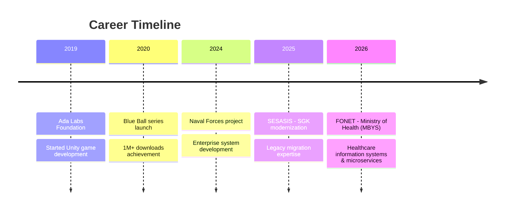

<div align="center">
  
</div>

<div align="center">
  
</div>

# Ömer ADA - Software Developer

<div align="center">
  
[](https://linkedin.com/in/omerada)
[](https://github.com/omerada)
[](mailto:iletisim@omerada.com)
[](https://play.google.com/store/apps/dev?id=7486779942763053895&hl=tr)

</div>

##  About Me

Hello! I'm **Ömer ADA**, a Full Stack Developer and Game Developer based in Ankara, Turkey.

>  **5+ years** of experience specializing in modern web technologies and game development

### Key Achievements

-  **2M+** total mobile game downloads
-  **SGK** - COBOL to Java migration for SGK modernization project, SGK EMEKTAR 4C Oracle Forms Project
-  **Turkish Naval Forces** - Enterprise vehicle management system development
-  **Official commendations** and performance awards
-  **Google Play Store** featured placements

---

## Currently

```typescript
const omerADA = {
  current: {
    role: "Full Stack Java Developer",
    company: "FONET",
    project: "Hospital Information Management System Project",
    focus: [
      "Microservices",
      "Spring Framework",
      "React",
      "Healthcare Information Systems",
      "CI/CD",
    ],
    location: "Ankara, Turkey",
  },
  experience: [
    {
      role: "Full Stack Java Developer",
      company: "SESASIS",
      project: "Social Security Institution (SGK) Modernization Project",
      focus: [
        "Legacy Migration",
        "COBOL to Java",
        "React",
        "Spring Framework",
      ],
      location: "Ankara, Turkey",
    },
  ],
};
```

---

## Tech Stack

### Backend Development

<div align="center">


</div>

### Frontend Development

<div align="center">


</div>

### Game Development

<div align="center">


</div>

### Database & DevOps

<div align="center">


</div>

---

## Featured Projects

### 🏢 Enterprise Projects

```
🔹 SGK Modernization Project (2024-Present)
   ├─ COBOL → Java Spring Boot migration
   ├─ DB2, React
   └─ Modern Tech

🔹 Turkish Naval Forces Vehicle Management System (2023-2024)
   ├─ Java Spring Framework + JSF
   ├─ MongoDB & MySQL integration
   └─ Official commendation award
```

### Popular Games

```
🔹 Blue Ball 10 - 1M+ downloads
   ├─ Unity 2D physics-based platformer
   ├─ 4.2⭐ Google Play rating
   └─ Featured placement

🔹 Blue Ball 11: Red Bounce Ball - 500K+ downloads
   ├─ Enhanced physics mechanics
   ├─ 100+ challenging levels
   └─ 4.3⭐ user rating

🔹 Car Driving Simulator Pro - 100K+ downloads
   ├─ Unity 3D realistic simulation
   ├─ AI traffic system
   └─ Cross-platform compatibility
```

### Web Platforms

```
🔹 Craftpilot.io
   ├─ React + Node.js full-stack platform
   ├─ Handicrafts community platform
   └─ Real-time messaging & collaboration

🔹 Automotive Platform (In Development)
   ├─ React Native + TypeScript
   ├─ AWS cloud infrastructure
   └─ Modern automotive solutions
```

---

## Skills Overview

<div align="center">

| **Category** |       **Technologies**       | **Level**  |
| :----------: | :--------------------------: | :--------: |
| **Backend**  | Java, Spring Boot, Hibernate | ⭐⭐⭐⭐⭐ |
| **Frontend** |  React, TypeScript, Next.js  |  ⭐⭐⭐⭐  |
|  **Mobile**  |    React Native, Unity 3D    |  ⭐⭐⭐⭐  |
| **Game Dev** | Unity, C#, Mobile Publishing | ⭐⭐⭐⭐⭐ |
| **Database** |  MySQL, PostgreSQL, MongoDB  |  ⭐⭐⭐⭐  |
|  **DevOps**  |      Docker, Git, CI/CD      |  ⭐⭐⭐⭐  |

</div>

---

##  Education & Certifications

🎓 **Süleyman Demirel University** - Computer Engineering (2018-2022)

- GPA: 3.32/4.0
- Focus: Software Engineering, Data Structures, Web Programming

---

##  Career Journey



---

## Areas of Interest

<div align="center">

`🎮 Game Development` `📱 Mobile Apps` `🌐 Web Technologies` `☁️ Cloud Computing`

`🤖 AI Engineering` `🔗 Blockchain` `📊 Data Science` `🎨 UI/UX Design`

</div>

---

## Mobile Game Portfolio

<div align="center">
  
|        Game         | Downloads | Rating | Platform |
| :-----------------: | :-------: | :----: | :------: |
|   **Blue Ball 10**   |   1M+   | 4.5⭐ | Android  |
|   **Blue Ball 11**   |  500K+  | 4.3⭐ | Android  |
| **Car Driving Simulator** |  100K+  | 4.1⭐ | Android  |

**Total: 2M+ Downloads**

</div>

---

## Get In Touch

<div align="center">

** Available for new projects!**

For project proposals, collaborations, or tech discussions:

 **Email:** iletisim@omerada.com
 **LinkedIn:** [linkedin.com/in/omerada](https://linkedin.com/in/omerada)
 **Website:**  [omerada.com](https://omerada.com/)

</div>

---

<div align="center">
  
</div>

<div align="center">
  
</div>

---

<div align="center">
  <i>⚡ "Code is art, problem solving is passion!" ⚡</i>
</div>
