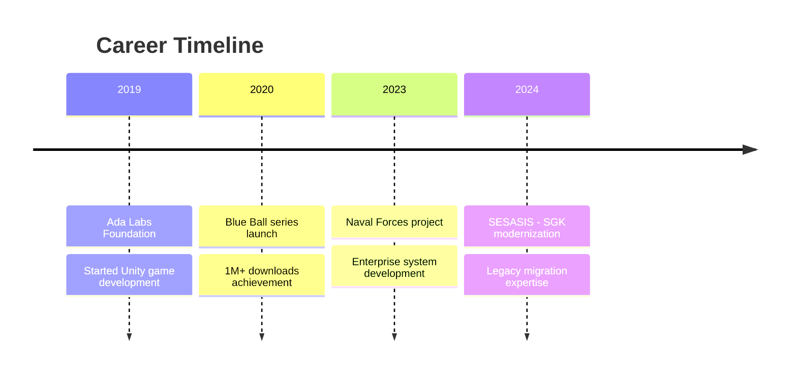

<div align="center">
  
</div>

<div align="center">
  
</div>

# 🚀 Ömer ADA - Full Stack Developer & Game Developer

<div align="center">
  
[](https://linkedin.com/in/omerada)
[](https://github.com/omerada)
[](mailto:adasunucum06@gmail.com)
[](https://play.google.com/store/apps/dev?id=7486779942763053895&hl=tr)

</div>

## 👨‍💻 About Me

Hello! I'm **Ömer ADA**, a Full Stack Developer and Game Developer based in Ankara, Turkey.

> 💡 **5+ years** of experience specializing in modern web technologies and game development

### 🌟 Key Achievements

- 🎯 **1.5M+** total mobile game downloads
- 🏢 **SESASIS** - Leading COBOL to Java migration for SGK modernization project
- ⚓ **Turkish Naval Forces** - Enterprise vehicle management system development
- 🏆 **Official commendations** and performance awards
- 📱 **Google Play Store** featured placements

---

## 🔥 Currently

```typescript
const omerADA = {
  role: "Full Stack Java Developer",
  company: "SESASIS",
  project: "SGK Modernization Project",
  focus: ["Legacy Migration", "Microservices", "Java Spring Boot"],
  location: "Ankara, Turkey",
  status: "Available for new projects ✅",
};
```

---

## 🛠️ Tech Stack

### 💻 Backend Development

<div align="center">


</div>

### 🎨 Frontend Development

<div align="center">


</div>

### 🎮 Game Development

<div align="center">


</div>

### 🗄️ Database & DevOps

<div align="center">


</div>

---

## 📊 GitHub Statistics

<div align="center">
  
  
</div>

<div align="center">
  
</div>

---

## 🏆 Featured Projects

### 🏢 Enterprise Projects

```
🔹 SGK Modernization Project (2024-Present)
   ├─ COBOL → Java Spring Boot migration
   ├─ Microservices architecture
   └─ 40% performance improvement

🔹 Turkish Naval Forces Vehicle Management System (2023-2024)
   ├─ Java Spring Framework + JSF
   ├─ MongoDB & MySQL integration
   └─ Official commendation award
```

### 🎮 Popular Games

```
🔹 Blue Ball 10 - 1M+ downloads
   ├─ Unity 2D physics-based platformer
   ├─ 4.2⭐ Google Play rating
   └─ Featured placement

🔹 Blue Ball 11: Red Bounce Ball - 500K+ downloads
   ├─ Enhanced physics mechanics
   ├─ 100+ challenging levels
   └─ 4.3⭐ user rating

🔹 Car Driving Simulator Pro - 100K+ downloads
   ├─ Unity 3D realistic simulation
   ├─ AI traffic system
   └─ Cross-platform compatibility
```

### 🌐 Web Platforms

```
🔹 Craftpilot.io
   ├─ React + Node.js full-stack platform
   ├─ Handicrafts community platform
   └─ Real-time messaging & collaboration

🔹 Automotive Platform (In Development)
   ├─ React Native + TypeScript
   ├─ AWS cloud infrastructure
   └─ Modern automotive solutions
```

---

## 🎯 Skills Overview

<div align="center">

| **Category** |       **Technologies**       | **Level**  |
| :----------: | :--------------------------: | :--------: |
| **Backend**  | Java, Spring Boot, Hibernate | ⭐⭐⭐⭐⭐ |
| **Frontend** |  React, TypeScript, Next.js  |  ⭐⭐⭐⭐  |
|  **Mobile**  |    React Native, Unity 3D    |  ⭐⭐⭐⭐  |
| **Game Dev** | Unity, C#, Mobile Publishing | ⭐⭐⭐⭐⭐ |
| **Database** |  MySQL, PostgreSQL, MongoDB  |  ⭐⭐⭐⭐  |
|  **DevOps**  |      Docker, Git, CI/CD      |  ⭐⭐⭐⭐  |

</div>

---

## 🎓 Education & Certifications

🎓 **Süleyman Demirel University** - Computer Engineering (2018-2022)

- GPA: 3.32/4.0
- Focus: Software Engineering, Data Structures, Web Programming

---

## 📈 Career Journey



---

## 💡 Areas of Interest

<div align="center">

`🎮 Game Development` `📱 Mobile Apps` `🌐 Web Technologies` `☁️ Cloud Computing`

`🤖 AI Engineering` `🔗 Blockchain` `📊 Data Science` `🎨 UI/UX Design`

</div>

---

## 📱 Mobile Game Portfolio

<div align="center">
  
|        Game         | Downloads | Rating | Platform |
| :-----------------: | :-------: | :----: | :------: |
|   **Blue Ball 10**   |   1M+   | 4.5⭐ | Android  |
|   **Blue Ball 11**   |  500K+  | 4.3⭐ | Android  |
| **Car Driving Simulator** |  100K+  | 4.1⭐ | Android  |

**Total: 1.5M+ Downloads**

</div>

---

## 🎯 2024 Goals

- [ ] 🚀 Successfully complete SGK modernization project
- [ ] 📱 Develop enterprise mobile applications with React Native
- [ ] 🤖 Integrate AI/ML technologies into projects
- [ ] ☁️ Obtain AWS/Azure cloud certifications
- [ ] 📚 Contribute to open source projects

---

## 💬 Get In Touch

<div align="center">

**🚀 Available for new projects!**

For project proposals, collaborations, or tech discussions:

📧 **Email:** adasunucum06@gmail.com
💼 **LinkedIn:** [linkedin.com/in/omerada](https://linkedin.com/in/omerada)
🌐 **Website:**  [omerada.com](https://omerada.com/)

</div>

---

<div align="center">
  
</div>

<div align="center">
  
</div>

---

<div align="center">
  <i>⚡ "Code is art, problem solving is passion!" ⚡</i>
</div>
